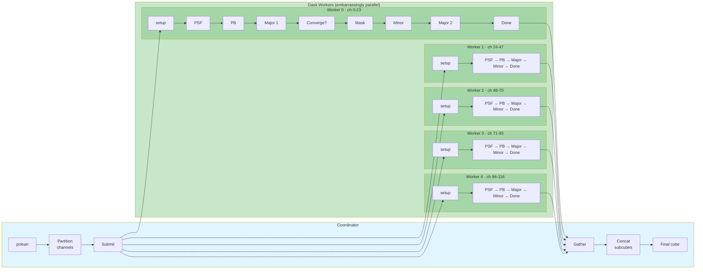
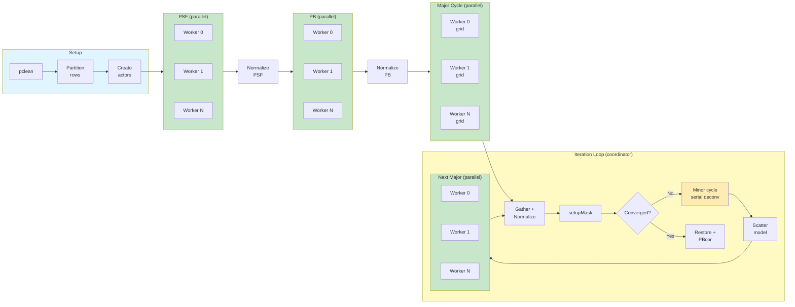

# Parallelization Modes

## Cube Mode (`specmode='cube'`)



## Continuum Mode (`specmode='mfs'`)



## Key Differences

| Aspect | Cube | Continuum (MFS) |
|--------|------|-----------------|
| **What's parallel** | Entire pipeline per subcube | Only gridding/degridding (major cycle) |
| **Minor cycle** | Parallel (per subcube) | Serial on coordinator |
| **Communication** | None (embarrassingly parallel) | Gather/scatter each major cycle |
| **Partition axis** | Frequency channels | Visibility rows |
| **Final assembly** | `imageconcat` of subcubes | Normalizer gathers partial images |

## Known Limitations

### `weighting='briggsbwtaper'` in Parallel Cube Mode

The `briggsbwtaper` weighting scheme (CAS-13021) requires the **fractional
bandwidth** of the full cube:

```
fracBW = 2 * (maxFreq - minFreq) / (maxFreq + minFreq)
```

In parallel cube mode each Dask worker images an independent sub-cube (often a
single channel), so the C++ auto-computation of `fracBW` from the sub-cube's
spectral axis would produce `0.0` and fail.

#### Fix

The `fracBW` parameter needs to be exposed through the casatools Python binding
(`synthesisimager.setweighting(fracbw=...)`), then pclean can pre-computes it from
the full cube `start`/`width`/`nchan` before dispatching to workers. Each
worker receives the correct full-bandwidth `fracBW` scalar alongside its
independent per-channel Briggs density grid.

**Requirements:**
- casatools must be rebuilt from the patched XML and C++ sources
- `start` and `width` must be specified as frequency quantities (e.g. `"100GHz"`)
  so the pre-computation can resolve them. If they are not parseable, `fracBW`
  falls back to `0.0` (auto-compute), which will still fail for single-channel
  sub-cubes.

#### Fallback workaround

Use `weighting='briggs'` (with `perchanweightdensity=True`, the default),
which computes per-channel Briggs weights independently — this is compatible
with per-channel parallelization but does not offer the improved imaging fidelity of
off-axis sources for wide-bandwidth cubes.

```python
pclean(
    ...
    weighting="briggs",   # not "briggsbwtaper"
    robust=0.5,
    perchanweightdensity=True,
    parallel=True,
    cube_chunksize=1,
)
```

#### CASA `tclean` reference

`tclean` itself also restricts `briggsbwtaper`:
- Requires `perchanweightdensity=True`
- Requires `specmode='cube'` (not `'mfs'` or `'cont'`)
- Requires `npixels=0`

See `task_tclean.py` lines 218–236 in casa6.
