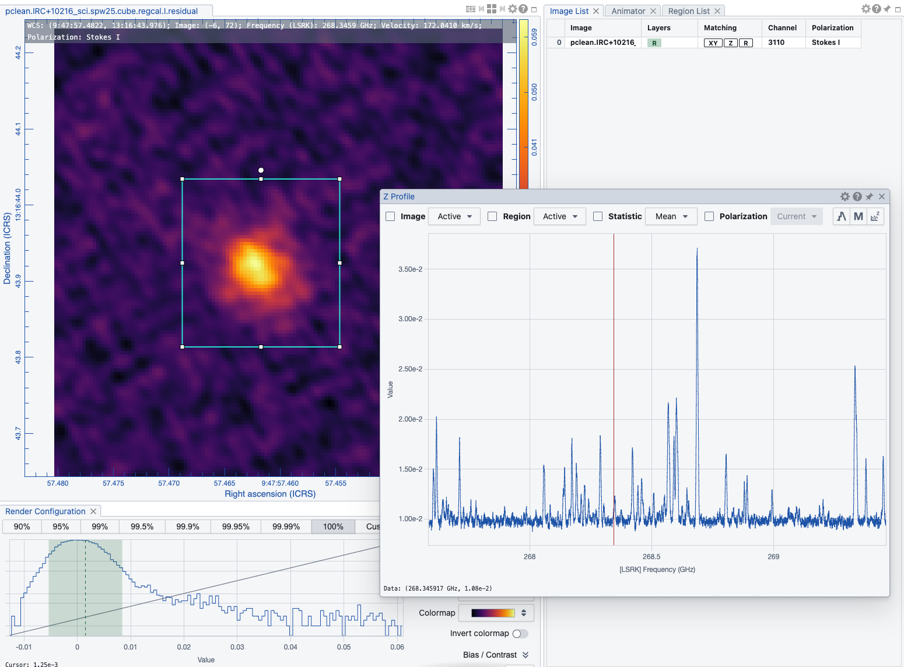

# pclean SLURM Submit Guide

## Overview

`pclean submit` is the recommended way to run parallel cube imaging on
HPC clusters.  It uses a **two-layer SLURM job stack**: one lightweight
**coordinator** job that hosts the Dask scheduler, and N **worker** jobs
spawned automatically via `dask-jobqueue.SLURMCluster`.

```
┌───────────────────────────────────────────────┐
│  Coordinator (SLURM job)                      │
│  • Hosts Dask scheduler                       │
│  • Partitions channels into sub-cubes         │
│  • Dispatches tasks to workers                │
│  • Concatenates sub-cube results              │
│                                               │
│  sbatch → dask-jobqueue spawns:               │
│  ┌────────────┐ ┌────────────┐ ┌───────────┐ │
│  │ Worker 0   │ │ Worker 1   │ │ Worker N  │ │
│  │ (SLURM job)│ │ (SLURM job)│ │(SLURM job)│ │
│  │ sub-cube 0 │ │ sub-cube 1 │ │sub-cube N │ │
│  └────────────┘ └────────────┘ └───────────┘ │
└───────────────────────────────────────────────┘
```

Each worker images one sub-cube independently (embarrassingly parallel,
no inter-worker communication).  The coordinator partitions the
frequency axis, submits Dask futures, waits for completion, and
concatenates the sub-cube images into the final cube.

---

## Quick Start

### 1. Write a YAML config

A minimal SLURM-enabled config needs `cluster.type: slurm` and the
`slurm:` / `submit:` sections.  See
[test_alma_pclean_v4.yaml](../scripts/test_alma_pclean_v4.yaml)
for a complete example.

### 2. Submit

```bash
pclean submit scripts/test_alma_pclean_v4.yaml
```

Output:

```
2026-03-12 05:24:08 INFO  pclean.config    Loading config from scripts/test_alma_pclean_v4.yaml
2026-03-12 05:24:08 INFO  pclean.parallel.submit  Wrote sbatch script to .../submit.sh
2026-03-12 05:24:08 INFO  pclean.parallel.submit  Submitted coordinator job 1631
Submitted coordinator job: 1631
```

### 3. Monitor

```bash
squeue --me
```

```
JOBID  PARTITION  USER   STATE    TIME  NAME
1631   queue      rxue   RUNNING  0:13  test_alma_pclean_v4-coordinator
1632   queue      rxue   RUNNING  0:10  test_alma_pclean_v4-1
1633   queue      rxue   RUNNING  0:10  test_alma_pclean_v4-2
...
1647   queue      rxue   RUNNING  0:09  test_alma_pclean_v4-16
```

The coordinator job appears first (job 1631).  Worker jobs are
auto-numbered (jobs 1632–1647, one per `nworkers`).

### 4. Override workdir

```bash
pclean submit scripts/test_alma_pclean_v4.yaml \
    --workdir /scratch/cubeimaging/run_01
```

---

## YAML Configuration Reference

### `cluster.slurm:` — Worker SLURM Settings

These control each **worker** SLURM job (passed to
`dask-jobqueue.SLURMCluster`):

| Field | Default | Purpose |
|-------|---------|---------|
| `queue` | `null` | SLURM partition (`--partition`) |
| `account` | `null` | SLURM account (`--account`) |
| `walltime` | `04:00:00` | Per-worker wall time (`--time`) |
| `job_mem` | `20GB` | Per-worker memory (`--mem`); must cover CASA RSS peak |
| `cores_per_job` | `1` | CPUs per worker; 1 is sufficient (CASA imaging is single-threaded) |
| `job_name` | `null` | Worker job name base (auto-suffixed: `-0`, `-1`, …) |
| `job_extra_directives` | `[]` | Extra `#SBATCH` lines for workers |
| `python` | `null` | Python executable path on compute nodes |
| `local_directory` | `null` | Scratch directory on compute nodes |
| `log_directory` | `logs` | Directory for worker stdout/stderr |
| `job_script_prologue` | `[]` | Shell commands before worker starts (e.g. `module load`) |

### `cluster.submit:` — Coordinator Job Settings

These control the **coordinator** sbatch script:

| Field | Default | Purpose |
|-------|---------|---------|
| `workdir` | `null` | Working directory for imaging output |
| `pixi_project_dir` | `null` | Root of pclean pixi project (auto-detected from config path) |
| `pixi_env` | `forge` | Pixi environment to activate in the sbatch script |
| `coordinator_mem` | `8G` | Memory for the coordinator (`--mem`) |
| `coordinator_cpus` | `2` | CPUs for the coordinator (`--cpus-per-task`) |
| `coordinator_walltime` | `24:00:00` | Wall time for the coordinator (`--time`) |
| `coordinator_job_name` | `pclean-coordinator` | Job name (appears in `squeue`) |
| `extra_sbatch` | `[]` | Additional `#SBATCH` directives |
| `log_dir` | `null` | Log directory (fallback: `pixi_project_dir/logs`) |
| `psrecord` | `true` | Wrap run in `psrecord` for resource profiling |

### `cluster:` — General Settings

| Field | Default | Purpose |
|-------|---------|---------|
| `type` | `local` | Cluster backend: `local`, `slurm`, or `address` |
| `parallel` | `false` | Enable parallel imaging |
| `nworkers` | `null` | Number of workers (= SLURM jobs in slurm mode) |
| `cube_chunksize` | `-1` | Channels per sub-cube (`-1` = auto: `nchan / nworkers`) |
| `concat_mode` | `auto` | Sub-cube concatenation: `auto`, `paged`, `virtual`, or `movevirtual` |
| `keep_subcubes` | `false` | Keep individual sub-cube images after concatenation |

---

## Example Config Walkthrough

From [test_alma_pclean_v4.yaml](../scripts/test_alma_pclean_v4.yaml):

```yaml
cluster:
  parallel:        true
  nworkers:        16           # 16 SLURM worker jobs
  cube_chunksize:  -1           # auto: 1000 ch / 16 = ~63 ch per worker
  concat_mode:     paged
  keep_subcubes:   false
  type:            slurm        # use SLURM backend

  slurm:
    queue:    queue              # SLURM partition name
    job_mem:  2GB                # each worker gets 2 GB (128×128 images are small)
    job_name: test_alma_pclean_v4
    python:   /path/to/.pixi/envs/forge/bin/python

  submit:
    workdir:              /path/to/output/  # images written here
    pixi_project_dir:     /path/to/pclean/  # for pixi shell-hook activation
    pixi_env:             forge
    coordinator_mem:      4G
    coordinator_cpus:     2
    coordinator_walltime: '24:00:00'
    coordinator_job_name: test_alma_pclean_v4-coordinator
    psrecord:             true
```

The output cube (IRC+10216, SPW 25, 1000 channels at 128×128):



### Sizing Guidelines

| Resource | Guideline |
|----------|-----------|
| `job_mem` | Must fit CASA's peak RSS for one sub-cube.  Use `pclean --estimate-memory` or see [memory_estimation.md](memory_estimation.md). Small images (128²) need ~2 GB; large mosaics (8000²) may need 40+ GB. |
| `coordinator_mem` | The coordinator does no imaging — 4–8 GB is usually sufficient for Dask bookkeeping and final concatenation. |
| `nworkers` | Ideally `nchan` is evenly divisible.  More workers = smaller sub-cubes = faster but more SLURM overhead. |
| `walltime` | Set generously; each worker images `nchan/nworkers` channels.  A 128² × 63-channel sub-cube with `niter=0` typically finishes in minutes. |

---

## What `pclean submit` Does Internally

1. **Loads config** from the YAML file.
2. **Generates sbatch script** (`<workdir>/submit.sh`) with coordinator
   SLURM directives, pixi environment activation, and `python -m pclean`
   invocation (optionally wrapped in `psrecord`).
3. **Calls `sbatch`** to submit the coordinator job.
4. **Coordinator runs** on the allocated node:
   - Creates a `dask_jobqueue.SLURMCluster` with the `slurm:` settings.
   - Calls `cluster.scale(jobs=nworkers)` — each worker is a separate
     SLURM batch job.
   - Partitions the frequency axis into sub-cubes.
   - Dispatches sub-cube imaging tasks via Dask futures.
   - Waits for completion, concatenates results.
   - `SLURMCluster.close()` cancels all worker jobs.

---

## Cleanup

If the coordinator is killed abnormally (e.g. OOM, walltime), orphan
worker jobs may remain.  Clean them up with:

```bash
scancel --name=test_alma_pclean_v4    # cancel all workers by job_name
scancel <coordinator_job_id>          # cancel the coordinator itself
```

---

## Related Documentation

| Document | Topic |
|----------|-------|
| [parallelization.md](parallelization.md) | Cube vs. continuum parallel architecture, known limitations |
| [code_structure.md](code_structure.md) | Module-level overview and design decisions |
| [memory_estimation.md](memory_estimation.md) | RAM estimation heuristics for worker sizing |
| [memory_management.md](memory_management.md) | Why Dask memory limits are disabled (`memory_limit='0'`) |
| [dev_guide.md](dev_guide.md) | Development setup, testing, CI |
| [config_current.md](config_current.md) | Full configuration reference |
| [defaults.yaml](../src/pclean/configs/defaults.yaml) | Auto-generated default values for all config fields |
